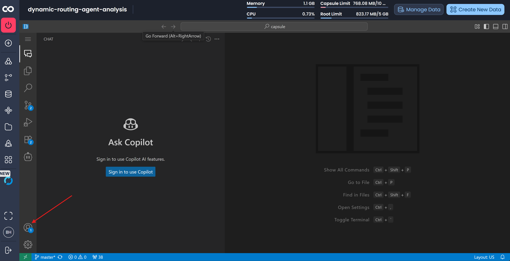
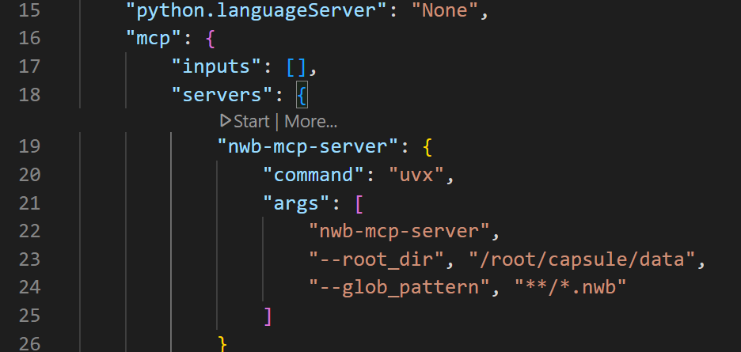
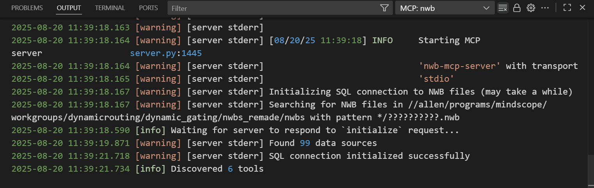
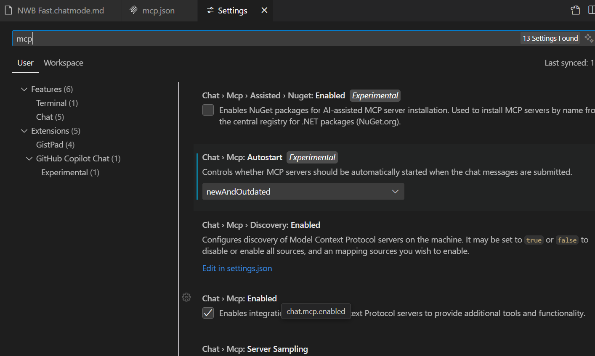

# MCP server in Copilot basics

### Attach data asset(s) and launch VS Code cloud workstation

### Sign into github account
Must be member of AIND organization to get Copilot business plan.

---
## Add MCP tools
Add custom functions decorated with `@mcp.tool` to [server.py](/code/server.py).

Best practices:

- add type annotations for parameters and data returned
- create as few tools as possible to constrain choices for LLM
- output as little text as possible to keep high signal-to-noise, and avoid filling finite context window
- design a hierarchy of tools to help the LLM arrive at correct queries quickly:
    1. get available files with tables
    2. get schema for one file
    3. get data for one column
    ...
- create docstrings that instruct the LLM on usage (avoid repetition of parameters/types)
- use descriptive function and parameter names that the LLM can infer meaning from:

   ✅ `get_table_schema(csv_path: str) -> dict[str, str]:` 

   ❌ `schema(path: str):`

---
## Configure MCP server for VS Code
Edit [mcp.json](/code/.vscode/User/mcp.json) to update any input arguments:

Hit `Start` then `more > Show output` to see the server logs. 

If mcp.json does not have interactive elements, ensure MCP is enabled in settings (and enable  Autostart while there):

--- 
## Open Copilot Chat (`ctrl` + `alt` + `I`)

By default, Copilot Chat is in the secondary toolbar:

The 'Ask/Edit/Agent' mode selector may not be visible at first: send an initial prompt "hi" to reveal them.

---

## Customize agent behavior

General Copilot behavior can be customized in [copilot-instructions.md](/code/.github/copilot-instructions.md) - this will affect all modes (Ask, Edit, Agent, and custom modes).

Custom modes for particular tasks can be created by adding a `.chatmode.md` file, for example [/code/.github/chatmodes/Custom.chatmode.md](/code/.github/chatmodes/Custom.chatmode.md) - they can then be selected in the Copilot chat dialog. These can be used to control which tools are available to the agent. More info: https://code.visualstudio.com/docs/copilot/customization/custom-chat-modes#_custom-chat-modes

Instructions will involve some experimentation, but here are some tips:
- give the agent a specific goal and the form of the final result you want (code, a summary, a decision)
- be explicit
- use ALL CAPS to emphasize critical messages
- add tips on how and when to use particular MCP tools or custom libraries if there are non-obvious factors to consider, such as performance
